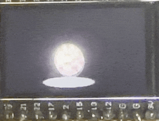

# ESPBoingBall

An Arduino sketch that renders a bouncing, spinning Boing Ball animation on an ESP32-driven TFT display. The animation is drawn directly with `TFT_eSPI`, using an off-screen sprite for smoother frame updates, simple gravity, wall bounces, shading, and a floor shadow.



## Features

- Red-and-white checker Boing Ball rendered as a shaded sphere
- Smooth animation using a `TFT_eSprite` frame buffer
- Basic gravity, bounce physics, horizontal movement, and spin
- Dynamic shadow that changes as the ball moves
- Backlight control through a configurable GPIO pin

## Hardware

This sketch is intended for an ESP32 board connected to a TFT display supported by the [`TFT_eSPI`](https://github.com/Bodmer/TFT_eSPI) library.

The current sketch enables the display backlight on GPIO 4:

```cpp
const int TFT_BACKLIGHT_PIN = 4;
```

Change that value in `ESPBoingBall.ino` if your board uses a different backlight pin, or remove the backlight setup if your display handles it separately.

## Requirements

- Arduino IDE or Arduino CLI
- ESP32 board support installed
- `TFT_eSPI` library installed
- A configured `TFT_eSPI` setup file for your display controller, resolution, and pins

## Getting Started

1. Clone or download this repository.
2. Open `ESPBoingBall.ino` in the Arduino IDE.
3. Install the `TFT_eSPI` library if it is not already installed.
4. Configure `TFT_eSPI` for your specific ESP32 and TFT display.
5. Select your ESP32 board and port.
6. Upload the sketch.

## License

This project is licensed under the MIT License. See [LICENSE](LICENSE) for details.
